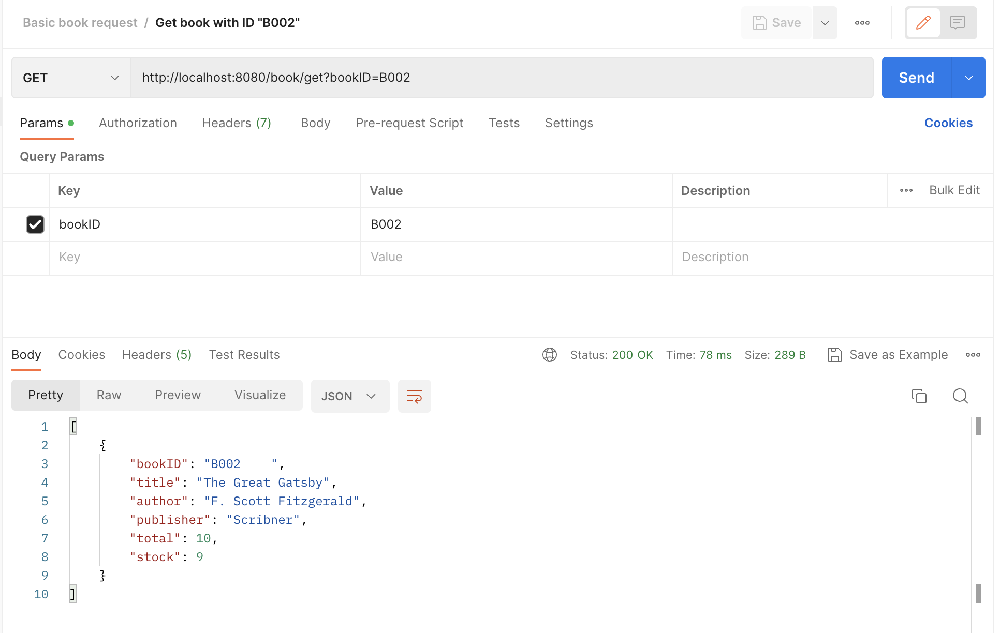

## 整体设计

#### 流程 - 从HTTP请求到SQL query

我想用一个例子说明整个图书管理系统是怎么运作的. 假设现在有用户向我们的后端框架发送HTTP请求, 这个请求可以是通过PostMan, CLI中的`curl`命令, 或是更加复杂的网页前端, 为了方便起见我们使用Postman进行说明. 例如现在用户想查询 bookID为B002的书相关信息, 对应的HTTP请求就是`http://localhost:8080/book/get?bookID=B002`). 我们的 Spring boot 后端框架将会接受这个HTTP请求, 并且根据我们写的代码将其转化成SQL Server query(`SELECT * FROM book WHERE bookID='B002';`), 这个query将会被传输到SQL Server Engine并且返回对应的查询结果到Spring boot, Spring boot 获取到结果进行相应处理并把它包装成 ResponseEntity 返回给前端.

>   
>
> 使用Postman向Spring Boot发送HTTP请求, 可以看到Spring Boot最终返回了B002的相关信息

#### Spring Boot workflow ( Link: [Here]([Architecture flow of spring boot Applications Spring boot uses all the... | Download Scientific Diagram (researchgate.net)](https://www.researchgate.net/figure/Fig-2-Architecture-flow-of-spring-boot-Applications-Spring-boot-uses-all-the-features_fig2_341151097)))

 

##### 代码框架

```sh
# spring-boot-server directory
src
├── main
│   ├── java
│   │   └── com
│   │       └── toydbbackend 
│   │           └── springbootserver
│   │               ├── SpringBootServerApplication.java
│   │               ├── controller # business logic
│   │               │   ├── BookController.java
│   │               │   └── BorrowController.java
│   │               ├── model # map tables
│   │               │   ├── Book.java
│   │               │   ├── Borrow.java
│   │               │   └── Card.java
│   │               ├── repository # define methods that convert Java code -> SQL query
│   │               │   ├── BookRepository.java
│   │               │   ├── BorrowRepository.java
│   │               │   └── CardRepository.java
│   │               └── service # something cool that I do not fully understand
│   │                   └── BookService.java
│   └── resources
│       ├── application.properties
│       ├── static
│       └── templates
└── test
    └── java
        └── com
            └── toydbbackend
                └── springbootserver
                    └── SpringBootServerApplicationTests.java
```

接下来我将结合之前提到的例子解释 Controller, Model, Repository 这三部分的代码作用

##### Controller - 负责业务逻辑

```Java
// BookController.java
@GetMapping(path = "/get")
    public ResponseEntity<Iterable<Book>> getAllBooks(@RequestParam(required = false) String bookID) {
        if (bookID != null && !bookID.isEmpty()) {
            List<Book> filteredBooks = bookRepository.findByBookID(bookID);
            if (filteredBooks.isEmpty()) {
                return ResponseEntity.notFound().build();
            } else {
                return ResponseEntity.ok(filteredBooks);
            }
        } else {
            Iterable<Book> allBooks = bookRepository.findAll();
            return ResponseEntity.ok(allBooks);
        }
    }
```

Controller是较好理解的一部分代码. 记号`@GetMapping(path = "/get")` 告诉Spring Boot这部分代码的对应URL. 整个函数返回 Response Entity(包括Status, header, body), 例如假设URL中的 `bookID` 并不在数据库中, 那么整个函数将会返回`ResponseEntity.notFound().build();`, 在Postman上将会显示`404 NOT FOUND`和一个空的body.

##### Model - 定义数据模型

```java
@Entity // This tells Hibernate to make a table out of this class
@Table(name = "book")
public class Book {
    @Id
    @Column(name = "book_no")
    private String bookID;

    private String title;
    private String author;
    private String publisher;
    private Integer total;
    private Integer stock;
    ...
}
```

Spring Boot中的Model代码非常像SQL中的`CREATE TABLE`语句, 两者都是用来定义数据模型, 看到这里你可能会产生一个疑惑: 既然我们在数据库中已经定义了表, 为什么还要多此一举再写一遍? 事实上你可以直接和数据库交互(例如使用Spring提供的`JdbcTemplate`), 但是 Model 能够为业务逻辑提供更好的支持并且让代码更具有可读性.

##### Repository - 负责将Java语句转化成SQL语句

```java
// bookRepository.java
public interface BookRepository extends JpaRepository<Book, String> {
    List<Book> findByTitle(String title);
    List<Book> findByBookID(String bookID);
}
```

Repository负责将Controller中用到的方法(例如`bookRepository.findByTitle(title)`) 转化成SQL语句. 大部分方法都会由Spring Boot自动生成, 我们只需要遵循命名规则即可, 但也可以自定义更加复杂的query, 例如:

```java
@Query("SELECT b FROM Borrow b WHERE b.card.cardID = :cardID AND b.book.bookID = :bookID AND b.returnDate is NULL")
    List<Borrow> findByCardCardIDAndBookBookIDAndNotReturned(@Param("cardID") String cardID, @Param("bookID") String bookID);
```

上面的方法声明了更加复杂的条件(例如`returnDate is NULL`).

### 遇到的一些问题

##### 数据库设计中的trigger和Spring Boot Java code中的双重验证

以“每个用户最多能借5本书”的限制为例, 我们在数据库中已经添加trigger来实现该目标了, 但是在 `borrowController.java`中我们还是用Java代码再实现了一遍逻辑:

```java
// borrowController.java
...
Optional<Book> bookToBorrow = bookRepository.findById(bookID);
        if (borrowRepository.countByCardCardIDAndNotReturned(cardID) >= 5) {
            log.info("borrow limits: 5 books max");
            return ResponseEntity.badRequest().body("You have reached the limit of 5 books");
        }
...
```

这样做的原因主要是:

如果把这部分检查代码去掉, 借书的请求将会转换成SQL代码输入数据库, 数据库的trigger将会产生错误, controller中对应的Java语句将会产生`DataIntegrityViolationException`. 我们当然可以用 try-catch 语句来检测错误, 但数据库一般都有多个trigger, 我们无法用一个异常来涵盖所有的情况,为此在Java代码中加上检查代码是必要的.

另外在Java代码中我们能给用户提供更加精确的控制, 例如自定义错误信息, 或者在用户达到借书上限时返回一个“还书”的选项. 


##### 怎么让测试产生相同的结果

方法1 

所有测试的SQL语句都设置Rollback

方法2

测试前把数据库中数据全部删了再插入一遍, 当然这是个笨办法

##### debug: 检查Hibernate产生的SQL语句

在debug中我们希望能够看到Repository对应产生的SQL语句, 为此我们可以在`src/main/resouces/application.properties`中加上如下代码:

```sh
spring.jpa.show-sql=true
logging.level.org.hibernate.SQL=DEBUG
logging.level.org.hibernate.type.descriptor.sql=TRACE
```

加上后当Hibernate产生对应SQL语句时, 我们可以在log中看到类似下面的内容

```
2023-05-18T20:39:10.831+08:00 DEBUG 72153 --- [nio-8080-exec-3] org.hibernate.SQL                        : select b1_0.book_no,b1_0.author,b1_0.publisher,b1_0.stock,b1_0.title,b1_0.total from book b1_0 where b1_0.book_no=?
Hibernate: select b1_0.book_no,b1_0.author,b1_0.publisher,b1_0.stock,b1_0.title,b1_0.total from book b1_0 where b1_0.book_no=?
```


#### Book Request

- [x] Fetch book with certain bookID / fetch all books
- [x] Update book info on given bookID
- [x] Change the book ID (would fail if the ID already exists)
- [x] Delete book with certain bookID(would return 404 not found if the book does not exist)
- [x] Add multiple books (would return error message if the book already exists)


#### Card Borrows

- [x] Test borrowing book with 0 stock
- [x] Test borrow limit for certain user (5 book Max)


#### TODO

- [ ] 前端React + Axios
- [ ] 复合查询(criteriaquery)
- [ ] 权限管理, 分离user和admin, 并且增加登陆模块
- [ ] Rollback 测试代码, 让测试代码能够重复跑
- [ ] Add Spring test code
- [ ] put it on cloud


